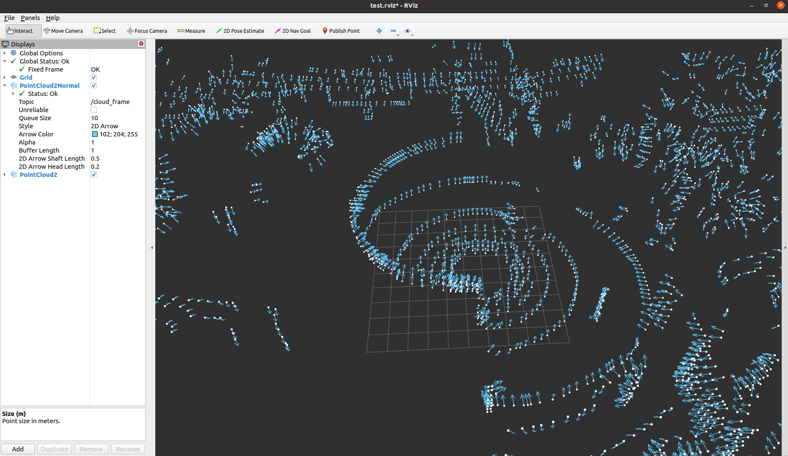

# PointCloud2 Normal Rviz Plugin
RViz plugin to display normal vectors of points in a point cloud, if available.

## Installation
Just place this ROS package under a ROS workspace, and run `catkin_make install`.

## Usage
The default RViz plugin can display points in a point cloud of the type sensor_msgs::PointCloud2.
This plugin can be used along with the default plugin to further display the normal vectors in 3D space.

It supports two styles of visualization for arrows (3D Arrow and 2D Arrow), as well as some common configurations
(color, size, etc.)

